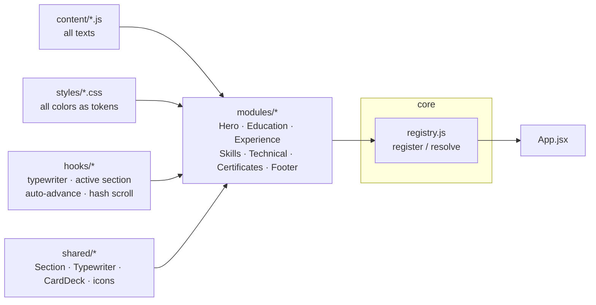

<div align="center">

# UWAYO PARFAIT

### Fullstack Web and Mobile App Developer

*A single-page portfolio engineered as a stacking deck — every section pins to the screen and the next one glides over it.*


</div>

---

## The View

A dark, cinematic canvas (`#14120e`) charged with sea green (`#2E8B57`) and warm cream (`#fffce1`). The hero opens on a turbulence-displaced radial glow — an SVG noise filter bending a green ring through black — while a framed panel carries the name in its top border and a self-typing role in its bottom border.

From there, the page behaves like a deck of cards:

| # | Section | Behavior |
|---|---------|----------|
| 01 | **Who am I** | Noise-gradient hero, border-labeled frame, typewriter caret |
| 02 | **Education** | Pins to the top, zoomed open-text entry slides in from the left |
| 03 | **Experience** | Covers Education, entry slides in from the right |
| 04 | **Skills** | Zooms in with green gradient rows and library icons |
| 05 | **Technical Skills** | Deep-green stage, bars animate to their percentages |
| 06 | **Certificates** | Flips in, gradient panels over a medal emblem |
| 07 | **Get in Touch** | Full-height green finale with circular contact icons |

Every section claims `min-height: 100dvh`, sticks at `top: 0`, and lets the next one scroll over it — the magic-scroll stacking effect, built with nothing but CSS `position: sticky` and layered shadows. Texts rewrite themselves every ~5 seconds. A custom green cursor tracks the pointer. No section ever shows a scrollbar.

## Architecture

Module-based with dependency injection: sections never import each other. Each one registers itself into a container and the app resolves an ordered list — add, remove, or reorder a section by touching one file.



<details>
<summary><b>Project structure</b></summary>

```
src/
├── core/          # DI container: register(), resolve(), resolveAll()
├── content/       # Every text on the site — nothing hard-coded
├── styles/        # Every color as a CSS variable — nothing hard-coded
├── hooks/         # useTypewriter, useActiveSection, useAutoAdvance, useHashScroll
├── shared/        # Section wrapper, Typewriter, CardDeck, icon wrappers
└── modules/       # One folder per section + header
    ├── header/    # Glass nav, active-link tracking, circular mobile menu
    ├── hero/      # Border-labeled frame over the noise gradient
    ├── education/
    ├── experience/
    ├── skills/
    ├── technical/
    ├── certificates/
    └── footer/
```

**House rule: no source file exceeds 20 lines.** Components stay atomic; behavior lives in hooks; looks live in tokens.

</details>

## Palette

| Token | Value | Role |
|-------|-------|------|
| `--accent` | `#2E8B57` | Sea green — actions, highlights, the hero ring |
| `--primary` | `#fffce1` | Cream — borders, titles, button inversions |
| `--bg` | `#14120e` | Near-black stage |
| `--surface` | `#1e1b15` | Panels and frames |
| `--muted` | `#b5ae9b` | Secondary text |

## Run It

```bash
npm install
npm run dev      # http://localhost:5173
npm run build    # production build → dist/
```

## Deploy to GitHub Pages

The Vite config already ships `base: "./"`, and navigation uses plain `#hash` anchors — no router, nothing to configure.

1. Push this repository to GitHub.
2. Run `npm run build`.
3. Publish the `dist/` folder — either point Pages at a `gh-pages` branch (`npx gh-pages -d dist`) or use a Pages workflow that uploads `dist/` as the artifact.

## Reach Me

**Uwayo Parfait** — Rwanda

[Email](mailto:parfaituwayo@gmail.com) · [WhatsApp](https://wa.me/250790401672) · [Call](tel:+250790401672)

<div align="center">

*Less, but better — built with React, styled with tokens, animated with Motion.*

</div>
